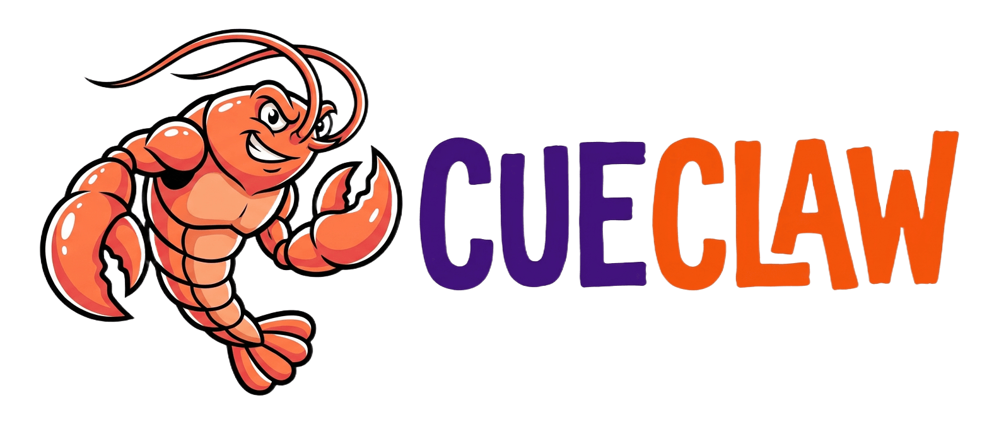
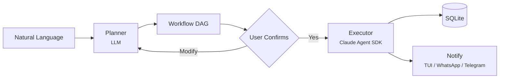

<p align="center">
  
</p>

<p align="center">
  An AI workflow orchestrator that turns natural language into executable DAGs. Built on the <a href="https://docs.anthropic.com/en/docs/claude-agent-sdk">Claude Agent SDK</a>.
</p>

## How It Works

```
You: "Every 30 minutes, check my X timeline for trending AI/LLM tweets,
      reply with a professional but friendly tone, and post a daily
      original tweet summarizing the day's trends."

CueClaw:
  ┌─ Plan: X (Twitter) Auto Engage ────────────┐
  │ Trigger: poll (30min)                      │
  │                                            │
  │ 1. Fetch timeline & trending topics        │
  │ 2. Filter AI/LLM related tweets            │
  │    └─ depends on: step 1                   │
  │ 3. Generate & post replies                 │
  │    └─ depends on: step 2                   │
  │ 4. Daily: compose & post trend summary     │
  │    └─ cron: 0 21 * * *                     │
  │                                            │
  │ [Y] Confirm  [M] Modify  [N] Cancel        │
  └────────────────────────────────────────────┘
```

Confirm the plan, and CueClaw runs it continuously in the background as a daemon.

## Features

- **Natural language in, workflow out** — Describe "when X happens, do Y". No YAML/JSON authoring.
- **Human-in-the-loop** — Review the generated DAG before anything runs. Modify or cancel at any point.
- **Multi-channel** — TUI, WhatsApp, or Telegram. All channels share identical capabilities.
- **Triggers** — Poll scripts, cron schedules, or manual. Runs as a system service with auto-restart.
- **Parallel DAG execution** — Independent steps run concurrently. Dependencies are respected.
- **Container isolation** — Agents run in Docker with filesystem isolation and mount allowlists.

## Install

Runtime: **Node.js 22+**.

```bash
npm install -g cueclaw@latest
# or: pnpm add -g cueclaw@latest

cueclaw config set claude.api_key $ANTHROPIC_API_KEY
cueclaw
```

Or from source:

```bash
git clone https://github.com/memodb-io/cueclaw.git
cd cueclaw
pnpm install && pnpm build
```

Optional: [Docker](https://docker.com/products/docker-desktop) for container isolation, WhatsApp / Telegram for bot channels.

## Architecture



Single Node.js process. Each workflow step runs in its own agent session. Independent steps execute in parallel. Data flows between steps via `$steps.{id}.output` references. Optional Docker containers for OS-level isolation.

See [docs/architecture.md](docs/architecture.md) for the full design.

## Documentation

| Doc | Description |
| --- | --- |
| [PLAN.md](PLAN.md) | Implementation plan and milestones |
| [plans/](plans/) | Phase-by-phase implementation details |
| [docs/architecture.md](docs/architecture.md) | System design and security model |
| [docs/types.md](docs/types.md) | Workflow Protocol, Channel interface, DB schema |
| [docs/config.md](docs/config.md) | Configuration and CLI reference |
| [docs/testing.md](docs/testing.md) | Test strategy |

## License

Apache-2.0
