<p align="center">
  
</p>

<p align="center">
  An AI workflow orchestrator that turns natural language into executable DAGs. Built on the <a href="https://docs.anthropic.com/en/docs/claude-agent-sdk">Claude Agent SDK</a>.
</p>

<p align="center">
  <a href="https://www.npmjs.com/package/cueclaw"></a>
  <a href="https://github.com/memodb-io/cueclaw/actions"></a>
  <a href="https://github.com/memodb-io/cueclaw/blob/main/LICENSE"></a>
  
</p>

## How It Works

1. **Describe** what you want in plain language
2. **Review** the generated execution plan (DAG)
3. **Confirm**, and CueClaw runs it in the background as a daemon

```
You: "Every 30 minutes, check my X timeline for trending AI/LLM tweets,
      reply with a professional but friendly tone, and post a daily
      original tweet summarizing the day's trends."

CueClaw:
  ┌─ Plan: X (Twitter) Auto Engage ────────────┐
  │ Trigger: poll (30min)                      │
  │                                            │
  │ 1. Fetch timeline & trending topics        │
  │ 2. Filter AI/LLM related tweets            │
  │    └─ depends on: step 1                   │
  │ 3. Generate & post replies                 │
  │    └─ depends on: step 2                   │
  │ 4. Daily: compose & post trend summary     │
  │    └─ cron: 0 21 * * *                     │
  │                                            │
  │ [Y] Confirm  [M] Modify  [N] Cancel        │
  └────────────────────────────────────────────┘
```

### More Examples

<details>
<summary><b>GitHub Issue to Draft PR</b> — poll trigger, multi-step DAG</summary>

```
You: "Monitor my repo for issues assigned to me. Create a branch,
      analyze the issue, generate an implementation plan, and open
      a Draft PR linking the issue."

CueClaw:
  ┌─ Plan: Issue Auto PR ──────────────────────┐
  │ Trigger: poll (60s)                        │
  │                                            │
  │ 1. Clone repo & create feature branch      │
  │ 2. Analyze issue & generate plan           │
  │    └─ depends on: step 1                   │
  │ 3. Commit plan & create Draft PR           │
  │    └─ depends on: step 2                   │
  │ 4. Notify via Telegram                     │
  │    └─ depends on: step 3                   │
  └────────────────────────────────────────────┘
```

</details>

<details>
<summary><b>GitHub Trending Daily Digest</b> — cron trigger, Telegram notification</summary>

```
You: "Every day at 10am, scrape GitHub Trending for the top 10 projects,
      summarize each with stars/language/description, and send the digest
      to me on Telegram."

CueClaw:
  ┌─ Plan: GitHub Trending Digest ─────────────┐
  │ Trigger: cron (0 10 * * *)                 │
  │                                            │
  │ 1. Fetch GitHub Trending page              │
  │ 2. Extract top 10 projects with metadata   │
  │    └─ depends on: step 1                   │
  │ 3. Generate formatted digest summary       │
  │    └─ depends on: step 2                   │
  │ 4. Send digest via Telegram                │
  │    └─ depends on: step 3                   │
  └────────────────────────────────────────────┘
```

</details>

<details>
<summary><b>PR Review Loop</b> — interactive commands via poll trigger</summary>

```
You: "Watch my PRs. If someone comments /execute, run the plan in PLAN.md.
      If they comment /modify, update the plan. If /merge, squash-merge
      and close the linked issue."

CueClaw:
  ┌─ Plan: PR Review Loop ─────────────────────┐
  │ Trigger: poll (60s)                        │
  │                                            │
  │ 1. Parse trigger data for PR & command     │
  │ 2. Execute command (run/modify/merge)      │
  │    └─ depends on: step 1                   │
  │ 3. Comment result on PR & notify user      │
  │    └─ depends on: step 2                   │
  └────────────────────────────────────────────┘
```

</details>

## Features

**Core**
- **Natural language in, workflow out** — Describe "when X happens, do Y". No YAML/JSON authoring.
- **Human-in-the-loop** — Review the generated DAG before anything runs. Modify or cancel at any point.
- **Multi-turn planner** — The planner asks clarifying questions, stores credentials, then generates the workflow.
- **Parallel DAG execution** — Independent steps run concurrently via `Promise.all`. Dependencies are respected.

**Channels**
- **TUI** — Interactive terminal UI with themes, keyboard shortcuts, and real-time execution views.
- **WhatsApp** — Baileys-based. QR code auth, inline confirmation, typing indicators.
- **Telegram** — Grammy-based. Inline keyboard buttons, message chunking, callback queries.

**Infrastructure**
- **Daemon** — Runs as a launchd (macOS) or systemd (Linux) service with auto-restart on crash.
- **Triggers** — Poll scripts, cron schedules, or manual execution.
- **Concurrency control** — GroupQueue with global cap and per-workflow serialization.
- **Container isolation** (optional) — Docker execution with filesystem isolation, mount allowlists, and stdin-only secret delivery. Defaults to local mode with safety hooks.
- **Structured logging** — pino to `~/.cueclaw/logs/`, per-workflow execution logs, TUI log stream.

## Quick Start

Runtime: **Node.js 22+**.

```bash
npm install -g cueclaw@latest
cueclaw config set claude.api_key $ANTHROPIC_API_KEY
cueclaw
```

From source:

```bash
git clone https://github.com/memodb-io/cueclaw.git
cd cueclaw && pnpm install && pnpm build
pnpm dev  # or: node dist/cli.js
```

Optional: [Docker](https://docker.com/products/docker-desktop) for container isolation, WhatsApp / Telegram for bot channels.

## Architecture

```mermaid
flowchart TB
    subgraph Channels
        TUI[TUI<br/><small>Ink / React</small>]
        WA[WhatsApp<br/><small>Baileys</small>]
        TG[Telegram<br/><small>Grammy</small>]
    end

    subgraph Core
        Router[Message Router]
        PS[Planner Session<br/><small>multi-turn LLM</small>]
        Exec[Executor<br/><small>parallel DAG</small>]
        AR[Agent Runner<br/><small>Claude Agent SDK</small>]
    end

    subgraph Daemon
        TL[Trigger Loop<br/><small>poll / cron</small>]
        GQ[GroupQueue<br/><small>concurrency control</small>]
    end

    TUI & WA & TG --> Router
    Router --> PS
    PS -->|Workflow DAG| Router
    Router -->|User confirms| Exec
    Exec --> AR
    AR -->|local| SDK[Claude Agent SDK<br/><small>query&#40;&#41;</small>]
    AR -->|container| Docker[Docker Container]
    Exec --> DB[(SQLite)]
    TL --> GQ --> Exec
    Exec -->|notify| Router
    Router --> TUI & WA & TG
```



Single Node.js process. Each workflow step runs in its own agent session. Data flows between steps via `$steps.{id}.output` references. The daemon manages trigger evaluation and workflow execution with crash recovery.

See [docs/architecture.md](docs/architecture.md) for the full design.

## Commands

**CLI**

```bash
cueclaw                        # Launch TUI (default)
cueclaw new "description"      # Create workflow directly
cueclaw list                   # List all workflows
cueclaw status <id>            # Workflow details
cueclaw pause|resume|delete    # Lifecycle management
cueclaw daemon start|stop|status|install|uninstall|logs
cueclaw config get|set         # Configuration management
cueclaw setup                  # First-run validation
```

**TUI Slash Commands**

```
/new [description]     Create a new workflow
/list                  List all workflows
/status <id>           Workflow status
/cancel <id>           Cancel running workflow
/bot start|status      Manage bot channels
/daemon start|stop     Daemon control
/theme [name]          Switch theme (default, mono, ocean)
/help                  Show all commands
```

## Project Structure

```
src/
├── cli.ts                 # CLI entry point (commander)
├── config.ts              # YAML config + Zod validation
├── db.ts                  # SQLite persistence (WAL mode)
├── planner.ts             # LLM → Workflow DAG generation
├── planner-session.ts     # Multi-turn planner conversation
├── executor.ts            # Parallel DAG execution engine
├── agent-runner.ts        # Claude Agent SDK wrapper (local + container)
├── router.ts              # Message routing across channels
├── daemon.ts              # Background process + PID management
├── service.ts             # launchd / systemd integration
├── trigger-loop.ts        # Poll + cron trigger evaluation
├── container-runner.ts    # Docker container execution
├── container-runtime.ts   # Image management (build / pull)
├── channels/
│   ├── tui.ts             # TUI channel
│   ├── whatsapp.ts        # WhatsApp (Baileys)
│   └── telegram.ts        # Telegram (Grammy)
└── tui/
    ├── app.tsx            # Main TUI application
    ├── commands/          # Slash command registry
    ├── hooks/             # Custom React hooks
    ├── messages/          # Per-type message components
    └── theme/             # Theme system (3 built-in themes)
```

## Documentation

| Doc | Description |
| --- | --- |
| [PLAN.md](PLAN.md) | Implementation plan and milestones |
| [plans/](plans/) | Phase-by-phase implementation details |
| [docs/architecture.md](docs/architecture.md) | System design and security model |
| [docs/types.md](docs/types.md) | Workflow Protocol, Channel interface, DB schema |
| [docs/config.md](docs/config.md) | Configuration and CLI reference |
| [docs/testing.md](docs/testing.md) | Test strategy |

## Contributing

Contributions are welcome. CueClaw follows a **skills-over-features** philosophy — the core stays minimal, and domain-specific capabilities live as skills in `.claude/skills/`.

```bash
pnpm install          # Install dependencies
pnpm test             # Run tests (~309 tests, 33 files)
pnpm lint             # Lint
pnpm typecheck        # Type check
```

See [docs/testing.md](docs/testing.md) for test conventions (co-located tests, in-memory SQLite, mock patterns).

## License

Apache-2.0
